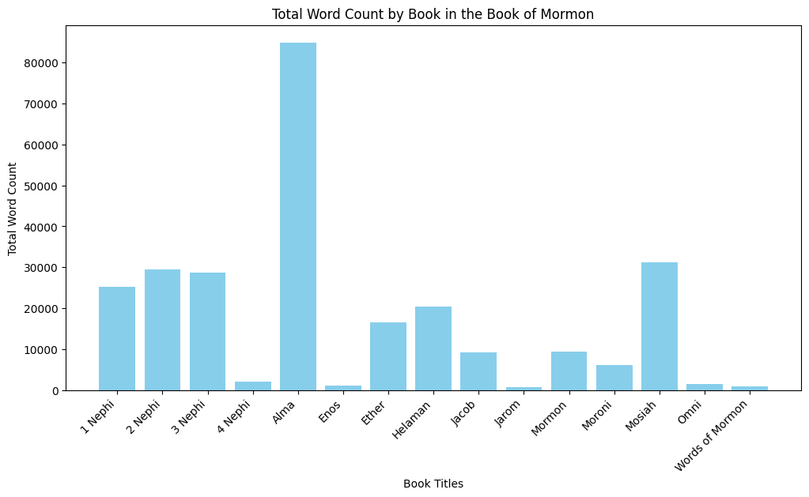

# Book of Mormon Word Counts

<!--  -->

<!--  -->

<!--  -->

Name | Frequency |
--- | --- |
Almighty |  |
Almighty God |  |
Being |  |
Beloved |  |
Beloved Son |  |
Christ |  |
Christ Jesus |  |
Christ the Son |  |
Counselor |  |
Creator |  |
Eternal Father |  |
Eternal God |  |
Eternal Head |  |
Eternal Judge |  |
Everlasting Father |  |
Everlasting God |  |
Father |  |
Father of heaven |  |
Father of heaven and of earth |  |
Founder of Peace |  |
God |  |
God of Abraham |  |
God of Abraham, and Isaac, and Jacob |  |
God of Abraham, and of Isaac, and the God of Jacob |  |
God of Isaac |  |
God of Jacob  |  |
God of miracles |  |
God of nature |  |
God of the whole earth |  |
Good shepherd |  |
Great Creator |  |
Great Spirit |  |
Head |  |
Holy Child |  |
Holy God |  |
Holy Messiah |  |
Holy One |  |
Holy One of Israel |  |
Holy One of Jacob |  |
Husband |  |
Immanuel |  |
Jehovah |  |
Jesus |  |
Jesus Christ |  |
Keeper of the gate |  |
King |  |
King of heaven |  |
Lamb |  |
Lamb of God |  |
Lord |  |
Lord God |  |
Lord God Almighty |  |
Lord God Omnipotent |  |
Lord God of Hosts |  |
Lord Jehovah |  |
Lord Jesus |  |
Lord Jesus Christ |  |
Lord of Hosts |  |
Lord of the Vineyard |  |
Lord Omnipotent |  |
Maker |  |
Man |  |
Master |  |
Mediator |  |
Messiah |  |
Mighty God |  |
Mighty One of Israel |  |
Mighty One of Jacob |  |
Most High |  |
Most High God |  |
Only Begotten of the Father |  |
Only Begotten Son |  |
Prince of Peace |  |
Prophet |  |
Redeemer |  |
Redeemer of Israel |  |
Redeemer of the world |  |
Rock |  |
Savior |  |
Savior Jesus Christ |  |
Savior of the world |  |
Son |  |
Son of God |  |
Son of Righteousness |  |
Son of the Eternal Father |  |
Son of the Everlasting God |  |
Son of the Most High God |  |
Stone |  |
Supreme Being |  |
True and Living God |  |
True Messiah |  |
True Vine |  |
Well Beloved |  |
Wonderful |  |
