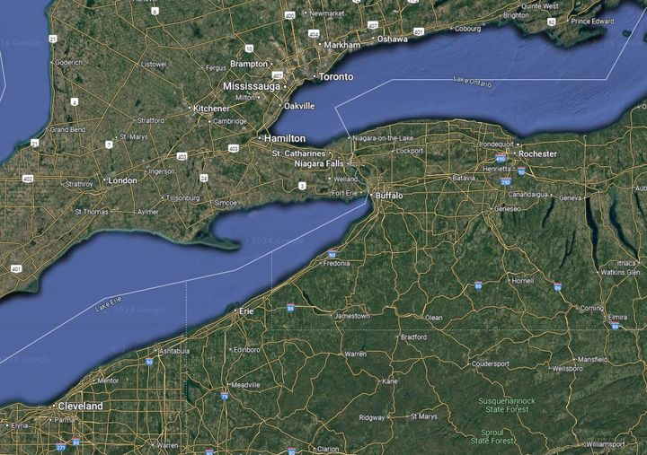

<!--  -->

<header class="cover bg-top" style="background-image:url(https://porterbmoody.github.io/balmingilead/images/bom%20geography.PNG)">

## Mesoamerican Model

Presented in [John Sorenson's Article](https://archive.bookofmormoncentral.org/sites/default/files/archive-files/pdf/sorenson/2024-04-18/john_l._sorenson_mormons_map_2000.pdf)

## Heartland Model

## Limited Geography Mesoamerican Model

## South American Model

## Baja California Model
